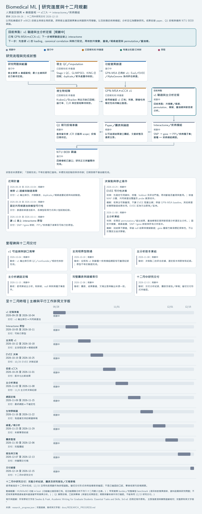

# NTU BEBI Thesis Template

國立臺灣大學**生醫電子與資訊學研究所**碩士論文 LaTeX 模板，所屬**電機資訊學院**。提供 Biomedical ML 章節骨架、草稿／定稿模式與 Thesis Lab 協作規則。這是非官方模板；實際送審仍須依臺大圖書館與 BEBI 當期規定辦理。

## 研究進度與規劃



圖表由唯一進度來源 [research_progress.json](research_progress.json) 產生，包含更新日期、各階段狀態、目前位置、短期計畫、決策點與時程。**已回報完成與有產出佐證分開標示；日期是規劃，不會自動將研究標為完成。**

[研究架構](docs/RESEARCH_ARCHITECTURE.md) · [文字版進度與證據](docs/RESEARCH_PROGRESS.md) · [更新方式](THESIS_GUIDE.md#研究進度更新)

```sh
python3 -m venv .venv-progress
.venv-progress/bin/python -m pip install -r scripts/requirements-progress.txt
.venv-progress/bin/python scripts/render_research_progress.py
.venv-progress/bin/python scripts/render_research_progress.py --check
```

README 與研究架構共用 `docs/research_progress.png`，更新 JSON 後重繪一次即可同步。Paper、Q1 投稿準備與 NTU BEBI 碩論都列入成果路徑；十二月中研究交付的確切形式見進度來源的 `deadline.note`。

本版以 [NTU-NCS-lab/NTU-Thesis-Writing-Template](https://github.com/NTU-NCS-lab/NTU-Thesis-Writing-Template) 為基礎，保留原始授權與作者資訊。預設文件不載入 NCS 實驗室樣式。來源見 [UPSTREAM.md](UPSTREAM.md)。

## Quick start

使用包含 XeLaTeX、latexmk 與 Biber 的 TeX 環境。在 Overleaf 上傳**小於 50 MB 的精簡專案 ZIP**，選擇 **XeLaTeX** 編譯器與 **draft.tex** 主文件。完整 GitHub ZIP 含上游備選字型，可能超過 [Overleaf 官方上傳限制](https://docs.overleaf.com/managing-projects-and-files/uploading-a-project)；其他未使用的中文字型可從上傳包省略，以下六個必要字型須保留原路徑：

- `fonts/chinese/BiauKai.ttf`
- `fonts/chinese/Kaiti-Black.ttf`
- `fonts/english/Times New Roman.ttf`
- `fonts/english/Times New Roman-Bold.ttf`
- `fonts/english/Times New Roman-Italic.ttf`
- `fonts/english/Times New Roman-BoldItalic.ttf`

只精簡上傳包，無須刪除 repository 中的字型資產。勿沿用上游 Overleaf 連結，該連結不包含本版修改。

1. 在 `ntusetup.tex` 填寫中英文題目、作者、指導教授、學號、年月與關鍵詞。指導教授欄位須連同真實學位／職稱填入；正式姓名及研究內容均留待使用者填寫。
2. 撰寫 `contents/chapter01.tex` 至 `chapter04.tex`；採用下方四章架構，以真實資料及已核對來源取代每個 `\thesisplaceholder{...}`。
3. 撰寫 `front/abstract.tex`、`front/denotation.tex` 與選擇性的 `front/acknowledgement.tex`；摘要環境自動讀取設定中的關鍵詞，符號與縮寫只列正文實際使用的項目。
4. 把核實過的文獻加入 `back/references.bib`，在正文用 `\cite{citation_key}` 引用。
5. 編譯草稿：

```sh
latexmk -xelatex -interaction=nonstopmode -halt-on-error draft.tex
```

`main.tex` 單獨編譯也預設為草稿。草稿中的提示是待完成標記，不是研究結果。

## Draft and final

| 入口 | 用途 | 行為 |
|---|---|---|
| `draft.tex` / `main.tex` | 日常撰寫 | 顯示 Draft 與待辦標記；不加送審浮水印／DOI。 |
| `final.tex` | 定稿格式檢查 | 黑色文字與連結、無 Draft；啟用浮水印／DOI；缺必要資料或仍有待辦時報錯。 |

取得自己的 TDR DOI、完成內容與 metadata 後，執行：

```sh
latexmk -xelatex -interaction=nonstopmode -halt-on-error final.tex
```

**剛下載的空白模板不能通過 final 編譯，這是預期的檢查機制。** 請填入真實資料，不要為了通過編譯而刪除檢查。`final` 不代表論文已完成、引文已審查，或已獲圖書館核可；PDF 保全仍需另外設定。

## Submission options

在 `ntusetup.tex` 中的 `\bebisetup{...}` 設定：

```latex
\bebisetup{
  print = false,
  verification = false,
  verificationfile = {front/verification.pdf},
  acknowledgements = true,
  watermarkfile = {figures/watermark.pdf},
}
```

- 電子版預設省略審定書，不留空白頁或目次項目。若要附上已簽署 PDF，設定 `verification = true`；插頁、羅馬頁碼與目次會一併處理。
- 紙本模式設 `print = true`，定稿時同時需要 `verification = true` 及已簽署審定書。外封面書脊須按印製尺寸另作，詳見[送審檢查](docs/NTU_COMPLIANCE.md)。
- 不寫謝辭可設 `acknowledgements = false`。
- 中文／英文關鍵詞各填 5–7 個，用逗號分隔。DOI 欄位填 TDR 分配的識別碼本體，不含 `doi:` 或網址；模板輸出時自動加上 `doi:`。

## Structure

| 檔案 | 編輯內容 |
|---|---|
| `ntusetup.tex` | 個人資料、題目、關鍵詞及輸出選項 |
| `contents/chapter01.tex` | Introduction：動機、背景、文獻、研究問題與論文安排 |
| `contents/chapter02.tex` | Materials and Methods：資料、前處理、分析流程、模型訓練與評估、實驗設定 |
| `contents/chapter03.tex` | Results and Discussion：主要與補充結果、穩健性、解釋及限制 |
| `contents/chapter04.tex` | Conclusion：有證據支持的結論、貢獻與未來工作 |
| `front/abstract.tex` | 中英文摘要 |
| `front/acknowledgement.tex` | 謝辭（可省略） |
| `front/denotation.tex` | 符號與縮寫；置於表次之後，沿用羅馬頁碼 |
| `back/references.bib` | 已核對的真實參考文獻；初始為空 |
| `back/appendix01.tex` | 可重現性與補充材料 |
| `bebi-thesis.cls`、入口文件 | 排版層；日常寫作不改 |

英文正文使用雙行間距，前置頁連續使用羅馬頁碼，正文自 1 開始。目次列入目次、圖次、表次。文稿仍須檢查長題目、圖表、跨頁內容與引用是否正確。

本版依使用者指定的參考論文改為四章主體。原八章的資料、方法、實驗設計、結果與討論提示已整併，研究內容仍由作者填寫。章節對應與使用界線見 [THESIS_STRUCTURE.md](docs/THESIS_STRUCTURE.md)。

開始 AI 協作前先讀 [THESIS_GUIDE.md](THESIS_GUIDE.md) 與 [AGENTS.md](AGENTS.md)。官方依據與人工處理項目見 [docs/NTU_COMPLIANCE.md](docs/NTU_COMPLIANCE.md)，來源查核日為 **2026-09-26**。

## License

沿用原始 [MIT License](LICENSE)：Copyright (c) 2017 Hsin-Hsiang Peng。感謝原作者 [Hsins](https://github.com/Hsins/NTU-Thesis-LaTeX-Template) 與 [NTU NCS Lab](https://github.com/NTU-NCS-lab/NTU-Thesis-Writing-Template)。學校標誌、字型與其他第三方素材不因模板 MIT 授權而取得額外授權；保留其來源與既有權利聲明。
